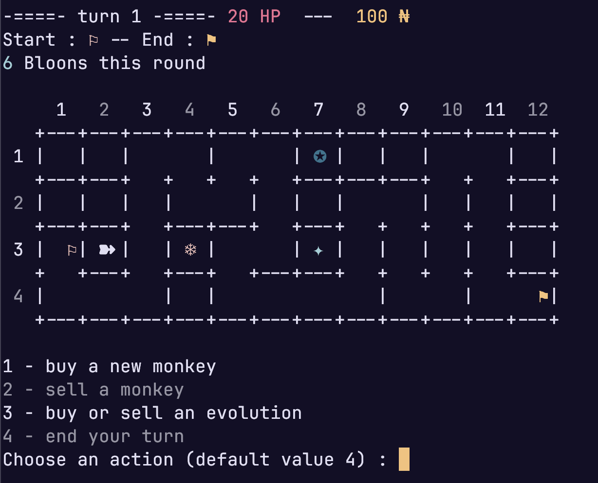
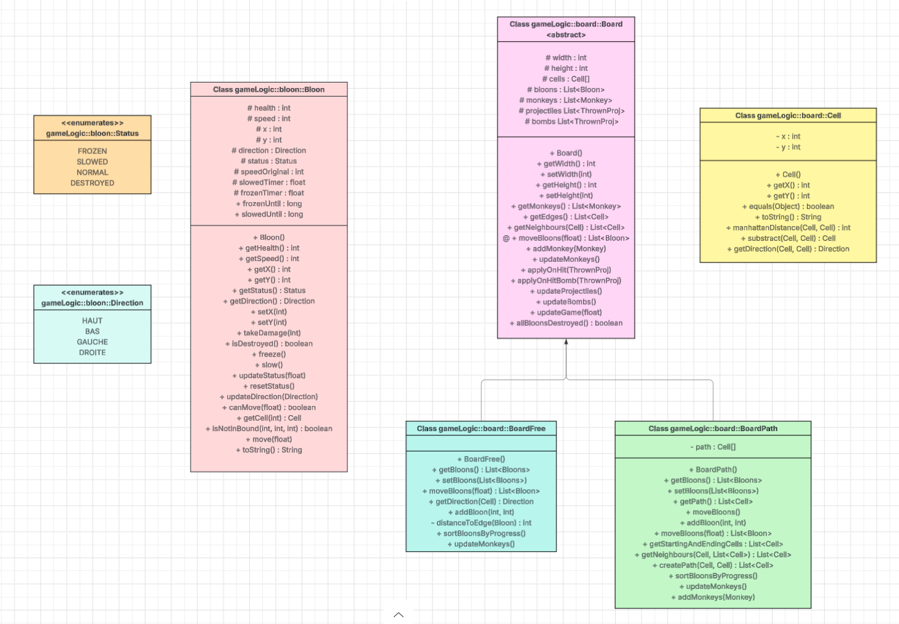
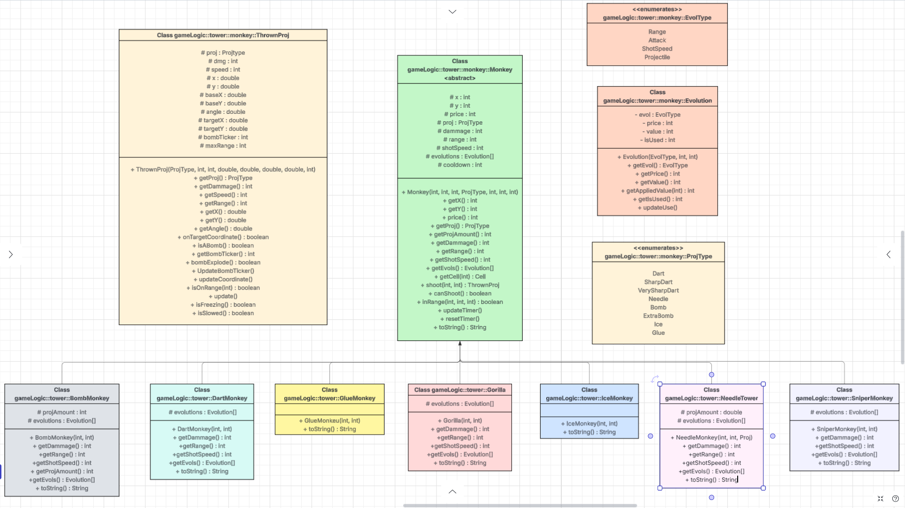
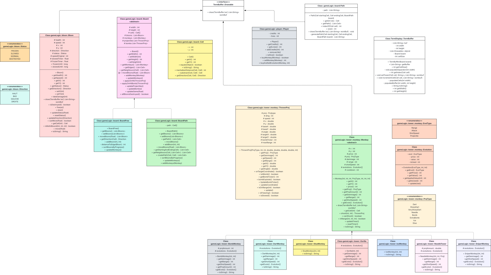
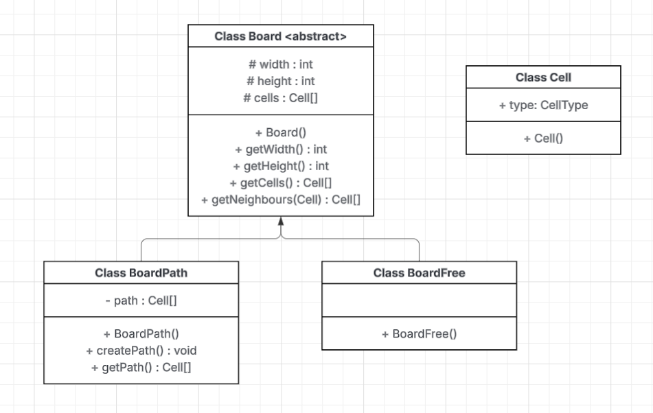
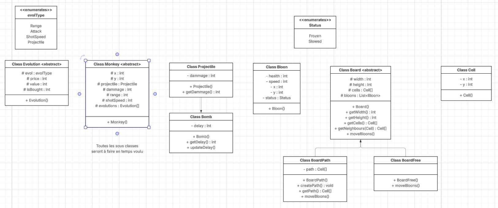
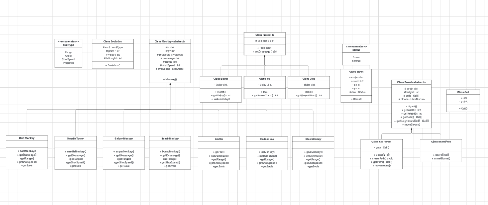
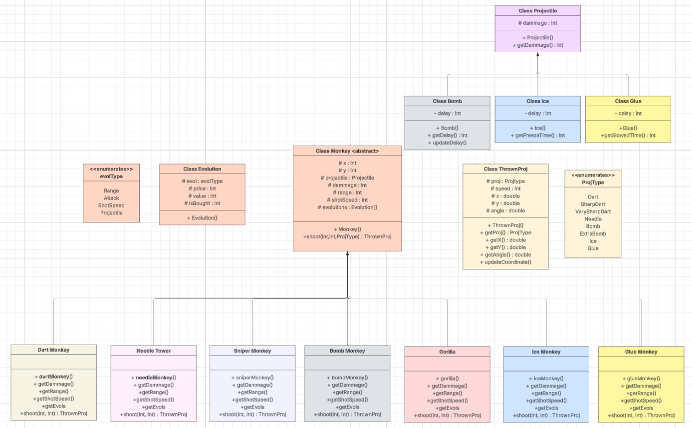
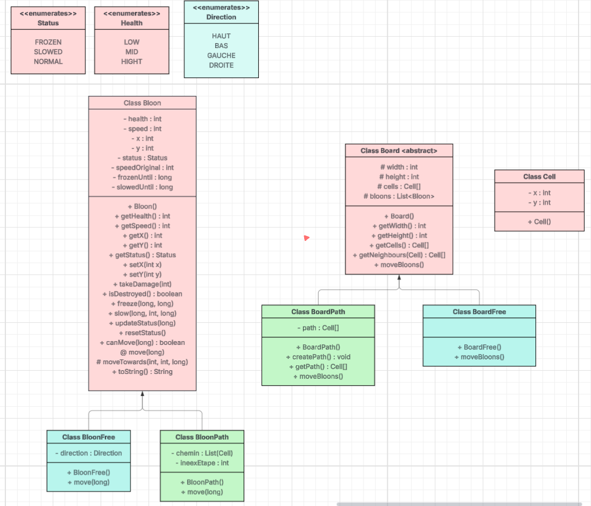
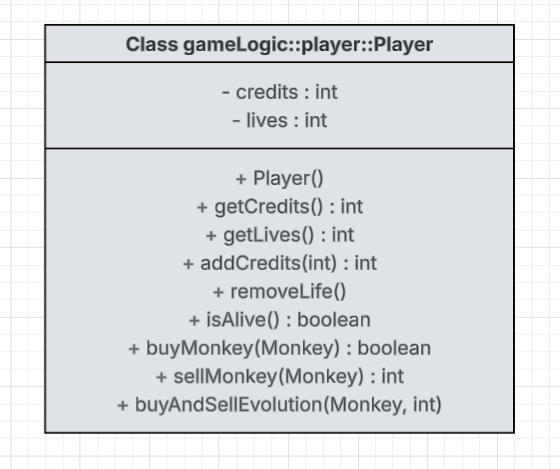

# l2s4-projet-2026

# Equipe

- Romann Szczepaniak
- Alix Carton
- Mounir Achbad
- Zacharie Deroo

# Sujet

[Le sujet 2026](https://www.fil.univ-lille.fr/~varre/portail/l2s4-projet/sujet2026.pdf)

# Rendu final
Toutes les commandes sont à faire à la racine du projet.

Compilation (dans la racine du projet)

```bash
make game
```

Pour exécuter le projet:

```bash
java -jar game.jar
```

Pour compiler les tests:

```bash
make tests
```

Pour exécuter les tests:

```bash
make runtests
```

Pour compiler la javadoc:

```bash
make docs
```
## Rendu du jeu



## Choix de conception

Notre projet est donc notre interpretation du sujet BloonTD, nous avons imaginé notre jeu de façon a être dans la capacité de réaliser un affichage graphique interractif.   
Pour ce faire nous avons donc choisi d'implémenter un system de coordonnées à tous les éléments du jeu, chaque tour à une position chaque balon, chaque case du chemin.  

L'objectif a toujours été de réalisé un projet modulaire facilement capable d'ajouté du contenu dans une éventuelle suite, les ballons sont donc tout a fait en capacité de recevoir d'autres status grace à l'utilisation d'un enum.
De même pour les singes qui sont très faciles a implémenter puisqu'ils sont tous issue de la classe abstraite monkey qui permet de créer autant de nouveau singe que souhaité.  

Pour nos évolution nous avons opté pour le choix de créer une classe evolution qui nous permet ensuite d'avoir plus de facilité a les utilisés grâce à des méthodes permettant de calculer tout seul les valeurs ajoutées des évolutions.  

Nos plateau et le déplacement de nos ballons sont peut être la partie la plus singulière du projet.  
Nous avons choisi d'opter pour des ballons auxquels on donne une direction de ce fait, pas besoin pour le plateau libre de créer quelconque chemin, on donne simplement une direction au bloon lors de sa création et il se déplacera dans cette direction jusqu'à ce qu'il sorte du plateau ou que sa direction soit changée si il est dans un plateau avec un chemin.  
Les plateau avec des chemins font simplement changé la direction du ballon lorsqu'il arrive à une intersection.  

Notre affichage marche pour l'affichage du plateau grâce à un système de callback, grâce auxquels chaque élément affichable est appelé pour s'afficher dans le terminal.  
Pour les intéractions avec le joueur on utilise simplement des inputs numérotés pour simplifié le jeu pour le joueur.  

Notre UML : 


## Fonctionnement de l'équipe 

Au commencement du projet, nous choisi de nous répartir les taches plutôt éloignés, certains travaillez sur les plateau,d'autre sur les tours et d'autres sur les ballons. Puis après les première semaine quand les moments d'assemblage des différentes classes sont arrivés, tout le monde a commencer a travailler sur chaque partie du jeu, plus personne n'étais spécialisé chacun était devenu capable de modifié différentes parties du projet sans soucis.  

## Difficultés Principales

Nos plus grandes difficultés auront surement été de voir les choses en trop grand, dès le départ nous avions dans l'optique de faire de ce projet un projet de grande envergure, nous voulions réalisé une interface graphique interractive.  
Ce qui nous a conduit a basé notre projet entier sur des coordonnées pour chaque éléments, ce qui n'a pas rendus le projet facile, ce choix nous a même fait revoir notre première implémentation des ballons et leur déplacement, ainsi que les projectiles des singes qui à la base étaient de réels projectiles qui été projeté sur le plateau.  
Cependant ces difficultés nous ont permis d'avoir un projet très modulaire et potentiellement utilisable dans le futur si nous voulions réalisé cette interface graphique

## Bilan

Ce projet a été très enrichissant pour nous tous, il nous a permis a travailler en équipe sur un gros projet, apprendre à bien se répartir les taches, à réaliser du code lisible et compréhensible pour tous, et à débattre d'idées pour nos choix d'implémentation.


# Livrables

Les paragraphes concernant les livrables doivent être remplis avant la date de rendu du livrable. A chaque fois on décrira l'état du projet par rapport aux objectifs du livrable. Il est attendu un texte de plusieurs lignes qui explique la modélisation choisie, et/ou les algorithmes choisis et/ou les modifications apportées à la modélisation du livrable précédent.

Un lien vers une image de l'UML doit être fourni (une photo d'un diagramme UML fait à la main est suffisant).

## Livrable 1

Grâce au Makefile, la phase de compilation du livrable est très simple. Il suffit, dans la racine de ce projet, d'exécuter la commande suivante: 

``` bash
make livrable1
```

Qui compilera toutes les classes Java et les packagera dans, respectivement, `livrable1a.jar` et `livrable1b.jar`

Pour exécuter ces fichiers, il faut lancer la commande suivante, dans la racine du projet : 

``` bash
java -jar livrable1<a/b>.jar <width> <height>
```

avec `<a/b>` correspondant aux fichiers `livrable1a.jar` et `livrable1b.jar`. `<width>` et `<height>` correspondent aux dimensions du plateau créé

### Atteinte des objectifs

 - Création des deux types de plateaux achevés
 - En particulier, l'algorithme de création du chemin
 - Création d'une classe Bloon pour représenter les ballons du plateau
 - Création de tous les types de tours, ainsi que leur évolution

### Difficultés restant à résoudre

Nous avons peut-être vu un peu trop large : nous avons trop dispersé le travail sur les fonctionnalités, ce qui a un coup sur la fiabilité actuelle de notre projet, comme nous n'avons malheureusement pas de tests, et certaines documentations ne sont pas complètes. Cependant, nous avons pour objectif de résoudre ces problèmes pour le prochain livrable.

Un autre problème plus technique : dû à l'implémentation de notre algorithme de création de chemin aléatoire, nous n'avons pas la main sur la case de départ et la case de fin : la seule condition est que ces cases soient sur le périmètre du plateau, et qu'elles soient assez éloignées (au moins une longueur de plateau).

### Choix de conception

Pour le second type de plateau (dit `BoardFree`), nous ne générons pas de chemin. Ce choix est motivé par la manière dont le `Board` comprend ses cases.

En fait, le `Board` ne stocke aucune de ces cases. Il stocke des objets (ballon et tour) dans une liste, et ces objets ont des positions en "valeur absolue". Ce que cela veut dire, c'est que le plateau ne comprend pas "Mon objet est dans la case (3, 5)", mais plutôt "Cet objet est en x=57 et y=35, et une cellule a une taille de 10. De fait, cet objet est en (5, 3)". Cela confère une grande indépendance aux objets vis-à-vis du plateau : ce sont les objets qui sont responsables de leur position, et non le plateau. Cela nous a amené à envisager `BoardFree` de la manière suivante : 

<center>Comme les objets sont responsables de leur position, ils sont responsables de leur déplacement.</center>

Pour `BoardPath`, on donne à chaque ballon une référence vers le chemin, et on leur dit "débrouillez-vous". Cela est pareil pour `BoardFree`. On envisage de créer une sous-classe de ballon qui contiendra un attribut direction. Grâce à cela, `BoardFree` aura simplement besoin de donner une position de départ aléatoire (sur la couronne), et la direction associée, et les ballons vivent leur vie de ballon à se déplacer tout droit sur le plateau.

## Livrable 2

Compilation/tests (dans la racine du projet) :

``` bash
git checkout livrable2
make livrable2
```

Pour exécuter les livrables, il faut écrire la commande suivante :

``` bash
java -jar livrable2<a/b>.jar <width> <height> <nbBloons>
```

### Atteinte des objectifs

- Les ballons bougent sur le plateau comme demandé (ou presque)
- Nous avons testé notre code 
- Nous avons amélioré la documentation de notre code
- Nous avons regroupé le code de tous les membres pour que le projet compile et fonctionne

### Difficultés restant à résoudre

Un test ne passe pas, dû à l'absence de logique sur la fin de course des ballons sur le plateau (pour BoardPath).
Nous avons rencontré beaucoup de difficulté pour faire compiler notre code, à cause de beaucoup de changements de code.

A part ça, pas vraiment de difficultés. Il faut peut-être voir maintenant comment faire fonctionner le plateau, les ballons et les tours ensemble...

### Choix de conception

Comme il n'y a toujours pas de chemin pour le BoardFree, on crée un ballon depuis un bord du plateau et on lui donne la direction appropriée. 

## Livrable 3

Compilation (dans la racine du projet) :

``` bash
git checkout livrable3
make livrable3
```

Pour exécuter les livrables, il faut écrire la commande suivante :

``` bash
java -jar livrable3<a/b>.jar <width> <height> <nbBloons>
```

### Atteinte des objectifs

Les tours sont créées, leur projectiles égalements. Il faut un "assez grand" plateau pour que les ballons aient une chance de bouger avant de se faire détruire (10 par 10 fonctionne bien par exemple)

### Difficultés restant à résoudre

L'objectif n'est pas bien atteint pour toutes ces raisons/difficultés :
- Comment bien gérer l'information lorsqu'un ballon est touché, détruit, sorti..
- Les projectiles font des dégats plusieurs fois pendant 1 seul tour, ce qui fait qu'un ballon, même détruit, se reprend des dégats, puisqu'on ne gère sa destruction qu'à la fin du tour
- On voulait faire que les projectiles sont des entités à part entière, qui bougent et non qui touchent la cible dès qu'ils tirent, mais ça a posé des problèmes donc c'est en pause
- Pas assez de tests

## Livrable 4


Compilation (dans la racine du projet) :

``` bash
git checkout livrable4
make livrable4
```

Pour exécuter les livrables, il faut écrire la commande suivante :

``` bash
java -jar livrable4<a/b>.jar <width> <height> <nbBloons>
```

### Atteinte des objectifs
Il faut toujours un assez grand plateau pour que les ballons puissent bouger sans se faire détruire directement par la horde de singes, sinon les évolutions sont bien gérées et fonctionnent correctement.

UML : 



### Difficultés restant à résoudre
Une modification du constructeur des tours fait que les anciens tests ne passent plus, car ils n'ont pas été changés, erreur qui sera corrigée pour le prochain livrable.
Sinon, pas beaucoup de difficultés restantes, il ne reste plus qu'a gérer le joueur et essayer de faire un bel affichage.

## Livrable 5

Compilation (dans la racine du projet)

```bash
git checkout livrable5
make jar
```

Pour exécuter le livrable :

```bash
java -jar livrable5.jar
```

UML :



### Atteinte des objectifs

Objectif atteints aucun soucis majeur

### Difficultés restant à résoudre

Corriger les bugs et quelques ajustements pour le dernier livrable

## Livrable 6

### Atteinte des objectifs

### Difficultés restant à résoudre

# Journal de bord

Le journal de bord doit être rempli à la fin de chaque séance encadrée, et **avant** de quitter la salle. 

Pour chaque semaine on y trouvera :
- ce qui a été réalisé, les difficultés rencontrées et comment elles ont été surmontées (on attend du contenu, pas uniquement une phrase du type "tous les objectifs ont été atteints")
- la liste des objectifs à réaliser d'ici à la prochaine séance encadrée

## Semaine 1

### Ce qui a été réalisé



Début de l'UML et du pseudo-code du chemin des ballons.

### Difficultés rencontrées

Aucune.

### Objectifs pour la semaine et répartition du travail par membre

Comment implémenter le chemin ? (Classe à part ? Liste dans le plateau ?)

Comment vérifier qu'un chemin est valide ?

(membres absents donc pas de répartition)

## Semaine 2

### Ce qui a été réalisé



Réaliation du prototype du générateur de chemin (en python)

### Difficultés rencontrées

Comment gérer les évolutions

### Objectifs pour la semaine et répartition du travail par membre

Tous réfléchir sur les boardFree

- Romann : implémente le boardPath
- Zacharie : singe et évolutions
- Mounir : ballons
- Alix : différentes tours

## Semaine 3

### Ce qui a été réalisé



- Romann : Création des Classes Board, BoardPath
- Alix : Création de la classe BoardFree et des Tests
- Mounir : Création de la classe Bloons
- Zacharie : Création des Classes Monkey, Projectile, Evolutions et toutes les sous classes des tours et des projectiles

### Difficultés rencontrées

Gestion du temps de jeu pour les ballons, reflexion sur la gestion des projectiles tirés par les singes/ du nombre de projectiles

### Objectifs pour la semaine et répartition du travail par membre

- Romann : Finir le main
- Alix : Affichage dans le terminal du plateau 
- Mounir : Enum des etat du ballon, vitesse
- Zacharie : Gestion des tires des singes et de leurs projectiles  

## Semaine 4

### Ce qui a été réalisé




Tests du plateau, gestion des états des ballons, projectiles

### Difficultés rencontrées

Temps difficile à gérer ; solution : chaque ballon a son propre temps

### Objectifs pour la semaine et répartition du travail par membre

- Zacharie : déplacement des ballons et vérification des tests
- Mounir : tests des Bloons
- Alix et Romann : gestion du temps d'un tour de ballon sur les plateaux

## Semaine 5

### Ce qui a été réalisé

Nous avons analysé ensemble les problèmes liés aux mouvements des ballons sur le chemin, et il faut toujours les régler car on ne comprend pas d'où vient une boucle infinie.

Les tous sont déjà implémentées.

### Difficultés rencontrées

Deux types de plateaux => mettre la liste des tours dans Board, ou dans BoardPath et BoardFree ?

Les ballons qui font du sur-place sur le chemin...

### Objectifs pour la semaine et répartition du travail par membre

- Mounir : Donner aux plateaux les tours.
- Alix : Gérer comment les tours attaquent les ballons.
- Zacharie : Régler le soucis des ballons sur le chemin.
- Romann : Création d'un classe pour l'affichage terminal.

## Semaine 6

### Ce qui a été réalisé

On a supprimé les classes `BloonPath` et `BloonFree` pour n'avoir qu'une classe `Bloon` : les ballons bougent dans une direction, soit tout droit dans `BoardFree`, soit sur un chemin dans `BoardPath` et quand le ballon est à un tournant, il recalcule sa direction.

Les projectiles ont des cooldown, et un angle.

### Difficultés rencontrées

Création des interfaces pour l'affichage

### Objectifs pour la semaine et répartition du travail par membre

- Mounir : mettre les tourelles sur le board
- Zach : finir la gestion de sprojectile et voir les modifs des singes
- Romann : interfaces pour affichage
- Alix : main pour livrables

## Semaine 7

### Ce qui a été réalisé
- Les tests d'évolution ont été fait 
- Correction des projectiles pour la NeedleTower
- Ajout de la verification pour ne pas poser une tour sur un chemin dans le plateau


### Difficultés rencontrées
- Aucune

### Objectifs pour la semaine et répartition du travail par membre
- Mounir / Zach: faire livrable 4
- Romann / Alix: completer les tests des mouvements des ballons

## Semaine 8

### Ce qui a été réalisé

### Difficultés rencontrées

### Objectifs pour la semaine et répartition du travail par membre

## Semaine 9

### Ce qui a été réalisé

- Création des mains
- Beaucoup de tests

### Difficultés rencontrées

- Soucis avec git
- Affichage des évolutions

### Objectifs pour la semaine et répartition du travail par membre

- Romann: continuer displayBuffer + régler pb de merge éventuellement
- Alix: Tests
- Zach et mounir: Intéractions utilisateur

## Semaine 10

### Ce qui a été réalisé



- Début des interactions utilisateurs (classe Player)
- Corrections des erreurs de tests du livrable 4 (qui ont été push après le tag livrable4 malheureusement)
- Des interfaces et classes permettant le rendu sur le terminal 

### Difficultés rencontrées
Modifier le BoardPath pour que Path soit une classe à part demande à modifier beaucoup des anciennes méthodes

### Objectifs pour la semaine et répartition du travail par membre
- Romann : finir DisplayBuffer
- Zach : commencer la classe Game qui gère les tours de jeu
- Mounir : finir les intéractions utilisateur et ses tests
- Alix : main du livrable 5 et gérer les tests des nouvelles classes

## Semaine 11

### Ce qui a été réalisé

Il y a maintenant un affichage graphique pour le plateau, avec ses ballons et tours, et chemin quand il y en a un.

Tous les tests passent.

### Difficultés rencontrées

Beaucoup de if/case pour les différents types de singes en demandant au joueur ce qu'il veut placer.

### Objectifs pour la semaine et répartition du travail par membre

- Alix : Corriger le bug du IceMonkey qui ne freeze pas.
- Zach : continue le Game
- Mounir : faire les tests de Player
- Romann : tests de l'affichage

Tous : main livrable 5

## Semaine 12

### Ce qui a été réalisé

Finalisation du jeu, corrections et ajouts d'élements dans l'affichage (numéro de colone/lignes, ajouts de couleurs/icones pour les tours, clear de la console entre chaque action pour un rendus plus épuré), corrections de mini défauts dans le jeu, ajouts de l'argent donné après chaque ballons détruit, et vie enlever a chaque ballon sortis

l'uml final : 


### Difficultés rencontrées

Nous avions pour objectif de faire un affichage graphique interractif, mais par manque de temps nous ne pouvons pas l'implémenter pour le livrable final.

### Objectifs pour finaliser le projet et répartition du travail par membre

Le projet est fini !!
